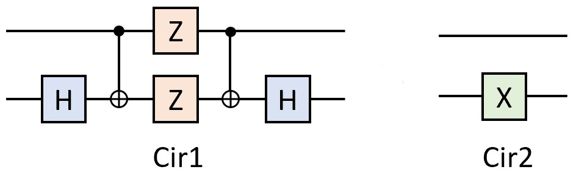
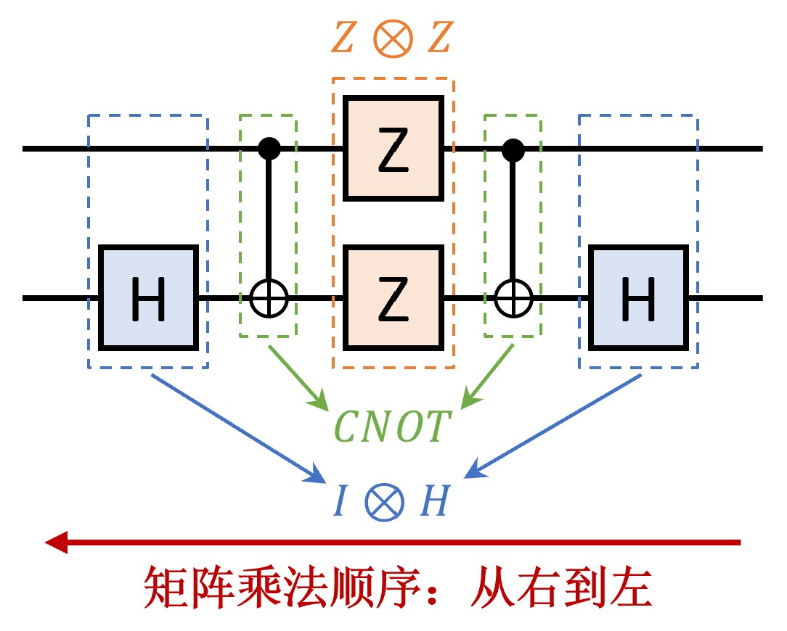
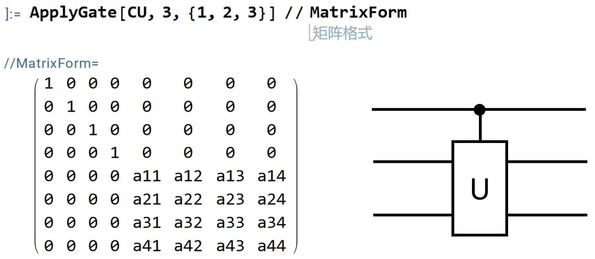
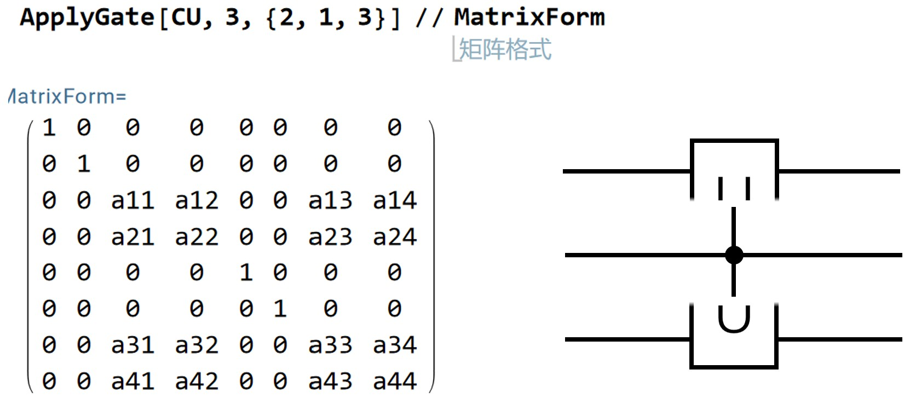

# QCirMat简介

QCirMat可用于在Mathematica中辅助构建量子线路的矩阵表示。结合Mathematica的符号计算能力，用户可实现量子线路的矩阵表示计算。

- 提供常见量子态、量子门的矩阵定义；
- 提供在指定量子比特上应用量子门，并计算其矩阵表示的函数；
- 提供构造受控量子门的函数；
- 提供量子哈密顿量模拟相关计算函数。

## 一、开始使用

可采用如下两种方式之一来使用本软件包：

1. 用Mathematica打开`QCirMat.nb`，并运行。
2. 将`QCirMat.txt`中的所有内容复制到Mathematica中，并运行。

## 二、功能简介

### 2.1 基本量子态的矩阵表示

QCirMat提供若干基本态的矩阵表示，支持三种形式：Ket表示、Bra表示和密度矩阵表示。

- Ket形式（列向量）
  - $\ket{0}$ ：`Ket0`
  - $\ket{1}$ ：`Ket1`
  - $\ket{+}$ ：`KetPlus`
  - $\ket{-}$ ：`KetMinus`
- Bra形式（行向量）
  - $\bra{0}$ ：`Bra0`
  - $\bra{1}$ ：`Bra1`
  - $\bra{+}$ ：`BraPlus`
  - $\bra{-}$ ：`BraMinus`
- 密度矩阵形式（Ket $\cdot$ Bra）
  - $\ket{0}\bra{0}$ ：`Rho0`
  - $\ket{1}\bra{1}$ ：`Rho1`
  - $\ket{+}\bra{+}$ ：`RhoPlus`
  - $\ket{-}\bra{-}$ ：`RhoMinus`
- Bell态的Ket形式
  - $\beta_{00} = \frac{1}{\sqrt 2}\left(\ket{00}+\ket{11}\right)$ ： `KetBell`
  - $\beta_{01} = \frac{1}{\sqrt 2}\left(\ket{01}+\ket{10}\right)$ ：`KetBell01`
  - $\beta_{10} = \frac{1}{\sqrt 2}\left(\ket{00}-\ket{11}\right)$ ：`KetBell10`
  - $\beta_{11} = \frac{1}{\sqrt 2}\left(\ket{01}-\ket{10}\right)$ ：`KetBell11`
- Bell态的Bra形式：`BraBell`, `BraBell01`, `BraBell10`, `BraBell11`
- Bell态的密度矩阵形式：`RhoBell`, `RhoBell01`, `RhoBell10`, `RhoBell11`
- Bloch球上的一般量子态的Ket形式 $e^{i\gamma}\left( \cos\frac{\theta}{2}\ket{0} + e^{i\phi}\sin\frac{\theta}{2}\ket{1} \right)$ ：`KetBloch[theta_,phi_,gamma_]`
- Bloch球上的一般量子态的Bra形式：`BraBloch[theta_,phi_,gamma_]`
- Bloch球上的一般量子态的密度矩阵形式：`RhoBloch[theta_,phi_,gamma_]`

### 2.2 基本量子门的矩阵表示

QCirMat提供若干基本量子门的矩阵表示。

#### 单比特门

- I门：`Id` （注：在Mathematica中`I`已被用于虚数单位）
- X门：`X`
- Y门：`Y`
- Z门：`Z`
- S门：`S`
- T门：`T`
- H门：`H`
- $S^{\dagger}$ 门：`Sdag`
- $T^{\dagger}$ 门：`Tdag`
- $\sqrt{X}$ 门：`SqrtX`
- $\sqrt{X^{\dagger}}$ 门：`SqrtXdag`

#### 多比特门

- CNOT门：`CNOT`
- 以第二个量子比特为控制位的CNOT门：`CNOT21`
- Toffoli门（CCNOT）：`Toffoli`
- CY门：`CY`
- CZ门：`CZ`
- CCZ门：`CCZ`
- CH门：`CH`
- SWAP门：`SWAP`
- iSWAP门：`iSWAP`
- Fredkin门（Controlled-SWAP）：`Fredkin`

#### 含参数门

- $R_x(\theta)$ 门：`Rx[theta_]`
- $R_y(\theta)$ 门：`Ry[theta_]`
- $R_z(\theta)$ 门：`Rz[theta_]`
- $U_1(\theta)$ 门：`U1[theta_]`
- $U_3(\theta,\phi,\lambda)$ 门：`U3[theta_,phi_,lambda_]`
- Controlled- $R_x(\theta)$ 门：`CRx[theta_]`
- Controlled- $R_y(\theta)$ 门：`CRy[theta_]`
- Controlled- $R_z(\theta)$ 门：`CRz[theta_]`
- Controlled- $U_1(\theta)$ 门：`CU1[theta_]`
- $R_{xx}(\theta)$ 门：`Rxx[theta_]`
- $R_{yy}(\theta)$ 门：`Ryy[theta_]`
- $R_{zz}(\theta)$ 门：`Rzz[theta_]`

### 2.3 用于构造复杂量子线路的矩阵表示的函数

#### ApplyGate函数

`ApplyGate`函数在指定下标的量子比特上应用指定的量子门，返回对应的矩阵表示。函数原型为：

```
ApplyGate[gate_, nqbits_, indexlist_]
```

- 参数`gate_`是一个 $2^k\times 2^k$ 矩阵，其中 $k$ 代表了量子门的比特数，例如单比特量子门（$k=1$）是 $2\times 2$ 矩阵，双比特量子门（$k=2$）是 $4\times 4$ 矩阵。
- 参数`nqbits_`是一个正整数，指定总量子比特数 $n$ ，该参数不能小于 $k$ 。
- 参数`indexlist_`是一个列表，按顺序指定要作用量子门的比特的下标，**注意在Mathematica中下标从1开始**。列表长度必须为 $k$ ，即与参数`gate_`的维数匹配。
- 该函数的返回值为一个 $2^n\times 2^n$ 维矩阵。

例：设总共有5个量子比特，以第4个量子比特为控制位，第2个量子比特为目标位应用一个CNOT门。可用如下方式调用：

```
In[*]:= ApplyGate[CNOT, 5, {4, 2}]
```

返回结果为一个 $32\times 32$（即 $2^5\times 2^5$）维矩阵。

#### ControlledGate函数

`ControlledGate`函数返回一个指定量子门的受控形式的矩阵表示。函数原型为：

```
ControlledGate[gate_, nctrlbits_]
```

- 参数`gate_`是一个 $2^k\times 2^k$ 矩阵，其中 $k$ 代表了量子门的比特数。
- 参数`nctrlbits_`是一个正整数，指定控制量子比特个数 $n$ 。
- 该函数的返回值为一个 $2^{n+k}\times 2^{n+k}$ 维矩阵，其中对应的前 $n$ 个量子比特为控制位， 后 $k$ 个量子比特为目标位。

联合使用`ControlledGate`和`ApplyGate`函数，可以生成以其中一些量子比特为控制位，其他一些量子比特为目标位的受控门的矩阵表示，见后文例2。

#### MultiGate函数

`MultiGate`函数生成在每个量子比特上分别应用一个单比特量子门的矩阵表示，即给定 $2\times 2$ 矩阵 $U$ 和总量子比特数 $n$ ，函数生成矩阵 $U^{\otimes n}$ 。函数原型为：

```
MultiGate[sqgate_, nqbits_]
```

- 参数`sqgate_`是个一个 $2\times 2$ 矩阵，表示单比特量子门。
- 参数`nqbits_`是一个正整数，表示总量子比特数 $n$ 。
- 函数返回一个 $2^n\times 2^n$ 维矩阵。

`MultiGate[U, 2]`等价于`KroneckerProduct[U, U]`；`MultiGate[U, 3]`等价于`KroneckerProduct[U, U, U]`。

### 2.4 对易子和反对易子

对易子 $[A, B]=AB-BA$

反对易子 $\{A,B\}=AB+BA$

```
Commutator[a_, b_]     := a . b - b . a
AntiCommutator[a_, b_] := a . b + a . b
```

### 2.5 量子哈密顿量模拟的矩阵表示

量子哈密顿量模拟算法即实现变换： $U=e^{-iHt}$ ，其中 $H$ 为代表量子系统哈密顿量的厄密矩阵， $t$ 为设定的演化时间。

设总哈密顿量可以写成 $m$ 个局部哈密顿量之和 $H=H_1+H_2+\dots+H_m$ ，若这 $m$ 个局部哈密顿量两两对易（即乘法可交换： $\forall i\neq j, H_iH_j=H_jH_i$ ），则对总哈密顿量的模拟可以严格分解为对各局部哈密顿量的依次模拟：

$$ e^{-i(H_1+H_2+\dots+H_m)t} = e^{-iH_1t}e^{-iH_2t} \dots e^{-iH_mt} $$

然而在实际中，各局部哈密顿量往往不具有对易性质，因此需要使用一定的近似公式来进行模拟。有两种常用的近似方式：Lie-Trotter和2阶Suzuki，它们分别可以近似到时间步长 $\Delta t$ 的平方和三次方。
Lie-Trotter公式：
$$e^{-i(H_1+H_2+\dots+H_m)\Delta t} = e^{-iH_1 \Delta t}e^{-iH_2 \Delta t} \dots e^{-iH_m \Delta t} + O(\Delta t^2)$$

2阶Suzuki公式：
$$e^{-i(H_1+H_2+\dots+H_m)\Delta t} = e^{-iH_1 \Delta t/2}e^{-iH_2 \Delta t/2} \dots e^{-iH_m \Delta t/2}e^{-iH_m \Delta t/2}e^{-iH_{m-1} \Delta t/2} \dots e^{-iH_1 \Delta t/2} + O(\Delta t^3)$$

因此在实践中，可以选定一个重复次数 $n$ ，并取时间步长 $\Delta t=t/n$ ，于是总的哈密顿量模拟可以分解为 $n$ 次重复：
$$e^{-i(H_1+H_2+\dots+H_m)t} \sim \left( e^{-iH_1 t/n}e^{-iH_2 t/n} \dots e^{-iH_m t/n} \right)^n$$

$$e^{-i(H_1+H_2+\dots+H_m)t} \sim \left( e^{-iH_1 t/2n}e^{-iH_2 t/2n} \dots e^{-iH_m t/2n}e^{-iH_m t/2n}e^{-iH_{m-1} t/2n} \dots e^{-iH_1 t/2n} \right)^n$$

QCirMat提供了量子哈密顿量模拟相关计算函数，包括精确计算，Trotter分解和二阶Suzuki分解的计算，以及对应的数值计算版本。

解析计算函数（ `hamiltonian_` 为单个哈密顿量矩阵， `shlist_` 为代表子系统的哈密顿量矩阵的列表， `t_` 为演化时间， `ndiv_` 为Trotter或Suzuki分解的重复次数 $n$ ）

```
HamiltonianSimulation[hamiltonian_, t_]
SubHamiltonianSumSimulation[shlist_, t_]
ApproximateHamiltonianSimulationTrotter[shlist_, t_, ndiv_]
ApproximateHamiltonianSimulationSuzuki2[shlist_, t_, ndiv_]
```

由于量子哈密顿量模拟解析计算的复杂度较大，QCirMat也提供了数值计算函数用于快速计算。数值计算函数为对应的解析计算函数加前缀 `N`

```
NHamiltonianSimulation[hamiltonian_, t_]
NSubHamiltonianSumSimulation[shlist_, t_]
NApproximateHamiltonianSimulationTrotter[shlist_, t_, ndiv_]
NApproximateHamiltonianSimulationSuzuki2[shlist_, t_, ndiv_]
```

## 三、示例

这里给出两个使用QCirMat在Mathematica中构造量子线路的实际案例。

### 例1. 检验下图两个量子线路的等价性



#### 1. 构造Cir1的矩阵表示

先分析一下Cir1的结构。如下图所示，Cir1可视为由5层组成，包含3种结构。从左数的第一层是一个 $I\otimes H$ 结构（第一个量子比特不作用门，即Identity；第二个量子比特作用H门），第二层是 $CNOT$ ，第三层是 $Z\otimes Z$ ，第四层是 $CNOT$ ，第五层是 $I\otimes H$ 。



在Mathematica中，矩阵乘法用`.`运算符，而矩阵的张量积（克罗内克积）则使用`KroneckerProduct`函数。因此，对于 $I\otimes H$ 和 $Z\otimes Z$ ，可分别使用

`KroneckerProduct[Id, H]`

`KroneckerProduct[Z, Z]` 或 `MultiGate[Z, 2]`

语句构造矩阵表示，其中`Id`、`H`、`Z`均为QCirMat中定义的量子门矩阵表示，`KroneckerProduct`为Mathematica内置函数，`MultiGate`为QCirMat中定义的函数。最终的量子线路的矩阵是将这五层的矩阵表示相乘。**请注意，矩阵乘法需要按照量子线路从右到左的顺序，** 即量子线路图最右边一层在乘积表达式中需出现在最左边。

```
In[*]:= Cir1 = KroneckerProduct[Id, H] . CNOT . KroneckerProduct[Z, Z] . CNOT . KroneckerProduct[Id, H]
Out[*]= {{0, 1, 0, 0}, {1, 0, 0, 0}, {0, 0, 0, 1}, {0, 0, 1, 0}}
```

#### 2. 构造Cir2的矩阵表示

Cir2较简单，只有一层 $I\otimes X$ ：

```
In[*]:= Cir2 = KroneckerProduct[Id, X]
Out[*]= {{0, 1, 0, 0}, {1, 0, 0, 0}, {0, 0, 0, 1}, {0, 0, 1, 0}}
```

#### 3. 利用矩阵相减比较两个量子线路

```
In[*]:= Simplify[Cir1 - Cir2]
Out[*]= {{0, 0, 0, 0}, {0, 0, 0, 0}, {0, 0, 0, 0}, {0, 0, 0, 0}}
```

输出是一个零矩阵，因此量子线路`Cir1`和`Cir2`是等价的。

### 例2. 构造受控双比特量子门，分别以不同量子比特为控制位


首先定义一个一般的双比特量子门`U`，它是 $4\times 4$ 矩阵，矩阵的每个元素都设为变量：

```
In[*]:= U = {{a11,a12,a13,a14}, {a21,a22,a23,a24}, {a31,a32,a33,a34}, {a41,a42,a43,a44}}
```

使用`ControlledGate`函数生成`U`的包含一个控制位的受控版本`CU`（$8\times 8$ 矩阵）：

```
In[*]:= CU = ControlledGate[U, 1]
```

根据`ControlledGate`函数的定义，返回的`CU`门的第一个量子比特为控制位，后两个量子比特为目标位。因此在使用`ApplyGate`函数时，通过指定`indexlist_`参数的下标顺序，即可将控制位指定为不同的下标。例如，指定为`{1,2,3}`则保持第一个量子比特为控制位：



指定为`{2,1,3}`则以第二个量子比特作为控制位：



指定为`{3,1,2}`则以第三个量子比特作为控制位：


## 四、联系我们

QCirMat由中国科学院高能物理研究所计算中心研发，得到了国家高能物理科学数据中心的支持。

项目负责人：龙沛洵
longpx@ihep.ac.cn

## 五、版本历史

2025/12/30 v0.3 版本更新
- 增加基本量子态的密度矩阵表示；
- 增加更多基本量子门；
- 修正bug。

2025/12/11 v0.2 版本更新
- 增加计算对易子和反对易子的函数；
- 增加量子哈密顿量模拟相关计算函数，包括精确计算，Trotter分解和二阶Suzuki分解的计算，以及对应的数值计算版本；
- 增加注释，修正bug。

2025/8/14 第一个公开版本（v0.1）
